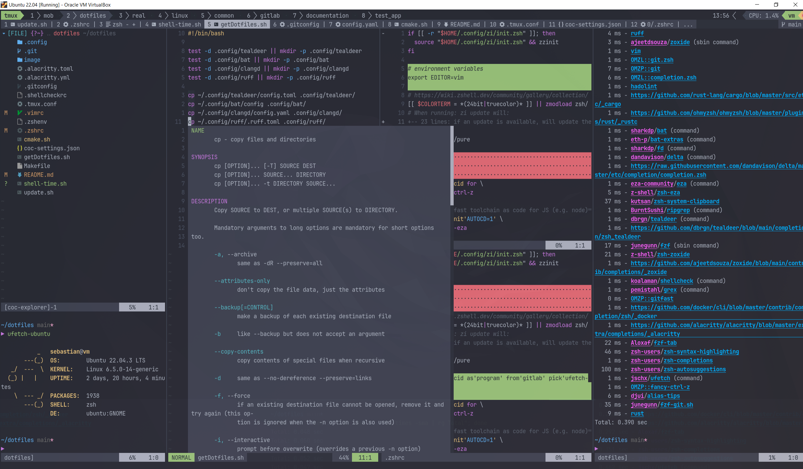

# dotfiles

My Linux dotfiles.

```bash
▶ for _ in $(seq 1 10); do time $SHELL -i -c exit; done
$SHELL -lic exit  0.05s user 0.01s system 59% cpu 0.102 total
$SHELL -lic exit  0.06s user 0.00s system 57% cpu 0.110 total
$SHELL -lic exit  0.06s user 0.00s system 56% cpu 0.109 total
$SHELL -lic exit  0.04s user 0.02s system 55% cpu 0.111 total
$SHELL -lic exit  0.04s user 0.02s system 56% cpu 0.110 total
$SHELL -lic exit  0.04s user 0.02s system 58% cpu 0.107 total
$SHELL -lic exit  0.04s user 0.02s system 56% cpu 0.109 total
$SHELL -lic exit  0.06s user 0.00s system 56% cpu 0.110 total
$SHELL -lic exit  0.05s user 0.01s system 57% cpu 0.106 total
$SHELL -lic exit  0.06s user 0.00s system 56% cpu 0.110 total
```



# Setup new machine

1. Install git
1. Setup WSL
1. `mkdir -p $HOME/.config` (otherwise, `.config` is a symlink to `$HOME/dotfiles/.config`).
1. Install zsh and zi
1. Install stow, run `stow .`
1. Install tmux

## pip

```bash
apt install python3.XX-venv # (e.g. 10)
apt install xclip #zsh-system-keyboard
```

Don't upgrade system to use other python version than that available in apt. Can cause other commands
(e.g. apt-get) to break.

## Remap CAPSLOCK to ctrl

https://askubuntu.com/questions/33774/how-do-i-remap-the-caps-lock-and-ctrl-keys#comment1154797_521734
sudo vi /etc/default/keyboard and change XKBOPTIONS="ctrl:nocaps"
setxkbmap -option ctrl:nocaps

https://superuser.com/questions/949385/map-capslock-to-control-in-windows-10

## VirtualBox

Update GuestAdditions after updating VirtualBox via https://help.ubuntu.com/community/VirtualBox/GuestAdditions.
```bash
sudo apt-get install virtualbox-guest-additions-iso
```

## wsl

* Install nerd font
    * on Linux via curl https://github.com/ryanoasis/nerd-fonts?tab=readme-ov-file#option-1-release-archive-download.
    * on Windows via downloading zip archive and using Settings -> fonts (move font files into dotted square)
* Install alacritty for Windows.
* Move alacritty.wsl.toml to [`%APPDATA%\alacritty`](https://github.com/alacritty/alacritty?tab=readme-ov-file#configuration).
* map capslock to ctrl: https://superuser.com/questions/949385/map-capslock-to-control-in-windows-10.
* Alternatively, use [MS PowerToys](https://learn.microsoft.com/en-us/windows/powertoys/install#installing-with-microsoft-store) to map Ctrl-M as Enter as well. Cannot map Ctrl-J to down (Ctrl-K up, Ctrl-C Esc) because that conflicts with either Linux or Windows shortcuts. In MS PowerToys dashboard, deactivate all other modules that are not needed.
* notifications: https://github.com/Windos/BurntToast, call with       `notify-send() { powershell.exe -command New-BurntToastNotification "-Text '${@}'"; }`. Further reading https://stuartleeks.com/posts/wsl-github-cli-windows-notifications-part-1/ and https://github.com/microsoft/WSL/issues/2466.

## zsh and zi

https://github.com/zsh-users/zsh/blob/master/INSTALL

`$ZPFX`: https://wiki.zshell.dev/docs/guides/customization#ZPFX

Install zsh to $HOME/.zi/polaris, where no sudo is needed.

```bash
mkdir -p $HOME/.zi/polaris
./configure --prefix=$HOME/.zi/polaris
```

zi loader is included in dotfiles (.config/zi); if not, see
https://wiki.zshell.dev/docs/getting_started/installation => loader.

### misc
* https://registerspill.thorstenball.com/p/how-fast-is-your-shell
* https://github.com/unixorn/awesome-zsh-plugins

### zshrcs
* https://github.com/mattmc3/zdotdir
* https://github.com/doronbehar/dotfiles/blob/master/.zshrc
* https://github.com/ctrueden/dotfiles/blob/main/zshrc
* https://github.com/itchyny/dotfiles/blob/main/.zshrc
* https://github.com/timtyrrell/dotfiles-chezmoi/blob/master/dot_zshrc
* https://github.com/Freed-Wu/Freed-Wu/blob/main/.zshrc
* https://github.com/kutsan/dotfiles/blob/master/.config/zsh/config/settings.zsh
* https://git.sr.ht/~seirdy/dotfiles/tree/master/.config/shell_common/zsh/zinit.zsh
* https://github.com/callistachang/dots/blob/main/dot_zshrc
* https://github.com/casey/dotfiles/blob/master/etc/zshrc
* https://github.com/agkozak/
* https://github.com/seagle0128/dotfiles/blob/master/.zshrc

## git

* https://github.com/stevearc/dotfiles/blob/master/.githelpers
* https://github.com/mathiasbynens/dotfiles/blob/main/.gitconfig

For Ubuntu, this PPA provides the latest stable upstream Git version: https://git-scm.com/download/linux.

Add .gitconfig.local for user private global entries
https://git-scm.com/docs/user-manual.html#telling-git-your-name

Add ssh key so that you can push to dotfiles repository with correct user.

In dotfiles repository, change local email to noreply email from Github (preferences, email)
https://docs.github.com/en/account-and-profile/setting-up-and-managing-your-personal-account-on-github/managing-email-preferences/setting-your-commit-email-address#setting-your-email-address-for-a-single-repository

ssh keys:
~/.ssh/config
specify, which key belongs to which host
(https://stackoverflow.com/a/69764024)

https://github.com/gabyx/Githooks
https://github.com/bigH/git-fuzzy
https://github.com/gitleaks/gitleaks

## alacritty

https://github.com/alacritty/alacritty/blob/master/INSTALL.md
```bash
cargo build --release
```

Windows: download executable

## TMUX

https://github.com/tmux/tmux/wiki/Installing#from-version-control

```bash
sh autogen.sh
./configure
make -j$(nproc) && sudo make install
```

`tmux new -s tmux`

.tmux.conf:
* https://github.com/doronbehar/.tmux/tree/master
* https://gist.github.com/adibhanna/979461c5f7d906daf24925fbd9b255eb
* https://github.com/mrnugget/dotfiles/blob/master/tmux.conf

## cargo and rust

Managed by zi.

Search rust book via cli:

https://github.com/0xhiro/thebook

## fzf

To auto-accept entry on Enter when searching with CTRL-R, use
https://github.com/junegunn/fzf/issues/477#issuecomment-444053054

Gets installed by zi

https://github.com/junegunn/fzf

This gets not installed by zi: https://github.com/junegunn/fzf-git.sh

Vim Integration: https://github.com/junegunn/fzf/blob/master/README-VIM.md

## docker

completion gets installed automatically by zi
https://docs.docker.com/develop/develop-images/dockerfile_best-practices/

## vim
https://learnvimscriptthehardway.stevelosh.com/

https://github.com/mattmc3/neovim-cheatsheet

* https://github.com/mrnugget/vimconfig/tree/master
* https://github.com/itchyny/dotfiles/blob/main/.vimrc
* https://github.com/mischavandenburg/dotfiles/blob/main/vim/.vimrc
* https://github.com/doronbehar/.config_nvim/tree/master
* https://github.com/habamax/.vim/blob/master/vimrc (vim maintainer)
* https://github.com/mrnugget/vimconfig/blob/master/vimrc
* https://github.com/skywind3000/vim/blob/master/init/unix.vim
* https://github.com/trapd00r/configs/blob/master/vim/vimrc
* https://github.com/suy/configs/blob/master/vimrc
* https://github.com/rhysd/dogfiles/blob/master/vimrc
* https://github.com/fannheyward/init.vim/blob/master/coc-settings.json
* https://github.com/fannheyward/init.vim/blob/master/init.vim

* https://bluz71.github.io/2021/09/10/vim-tips-revisited.html
* https://vimtricks.com/p/category/tips-and-tricks/
* http://vimcasts.org/episodes/search-multiple-files-with-vimgrep/
* https://github.com/yuki-yano/fzf-preview.vim

Gets installed by zi.
Important infos about editing .vimrc: https://vi.stackexchange.com/a/7723/30978

### lua support

```bash
apt install luaX.X libluaX.X-dev luajit
./configure --enable-luainterp=yes
```

### devcontainer

* https://www.docker.com/blog/how-to-setup-your-local-node-js-development-environment-using-docker/
* https://stackoverflow.com/questions/51809181/how-to-run-tmux-inside-a-docker-container
* https://wiki.zshell.dev/ecosystem/packages/usage#statically-linked-hermetic-relocatable-zsh

Login to dev container via ssh; install zsh and copy dotfiles
https://github.com/dpetersen/dev-container-base

* https://gitlab.com/smoores/open-devcontainer
* https://stackoverflow.com/questions/72397020/containerizing-vim-with-plugins
* https://github.com/nemanjan00/dev-environment
* https://github.com/esensar/nvim-dev-container

### linter

https://github.com/caramelomartins/awesome-linters

https://github.com/iamcco/diagnostic-languageserver/wiki/Linters
All of them are configured via coc-diagnostic. Activate them by mapping the
linter to the desired filetype in `coc-settings.json`.
https://github.com/iamcco/coc-diagnostic/blob/master/src/config.ts

#### bash-language-server

`volta install bash-language-server`

#### vint

VimL linter
https://github.com/Vimjas/vint

#### hadolint (Dockerfile linter)

https://github.com/hadolint/hadolint
gets installed by zi.

## C++ cpp

https://github.com/HappyCerberus/daily-bite-cpp (especially Modern-only C++ Course)
[Playlist: Modern C++ Series - Mike Shah](https://www.youtube.com/playlist?list=PLvv0ScY6vfd8j-tlhYVPYgiIyXduu6m-L)
https://akrzemi1.wordpress.com/
https://www.meetingcpp.com/blog/blogroll/

playground
[HU print chunks 0001'0203'...'0e0f](https://godbolt.org/z/98zvoc7Eb)

### ccls

* https://github.com/MaskRay/ccls/wiki/Build
* https://github.com/MaskRay/ccls/wiki/Install

### CMake

Use install-cmake.sh from foonathan to install to /usr/local. May remove "old" cmake versions, check via `which -a cmake`.

https://blog.feabhas.com/category/build-systems/
with https://github.com/feabhas/cmake-presets-blog

* https://github.com/philips-software/amp-devcontainer/tree/main/.devcontainer/cpp
* https://github.com/intel/cicd-repo-infrastructure/
* https://github.com/StableCoder/cmake-scripts
* https://github.com/cpp-best-practices/cmake_template

#### misc

[cmake4vim](https://github.com/ilyachur/cmake4vim/)
[cmake-language-server](https://github.com/regen100/cmake-language-server) gets installed via zi and pip.

Determine the minimal required CMake version of a project: [cmake_min_version](https://github.com/nlohmann/cmake_min_version)

### llvm, clang, clangd

https://github.com/google/sanitizers/wiki/AddressSanitizerFlags
```cmake
message(STATUS "Address sanitizer enabled")
add_compile_options(-fsanitize=address,undefined)
add_compile_options(-fno-sanitize=signed-integer-overflow)
add_compile_options(-fno-sanitize-recover=all)
add_compile_options(-fno-omit-frame-pointer)
add_link_options(-fsanitize=address,undefined -fuse-ld=gold)
```

Installation description:
https://apt.llvm.org/ -> Automatic installation script
installs *all* llvm packages (also clangd, clang-tidy, include-cleaner etc) at `/bin`.
Also adds apt.llvm.org to apt package list to automatically get updates.

Need to update alternatives for clang-format, clangd, clang-tidy.
```bash
sudo update-alternatives --install /bin/clang-format clang-format /bin/clang-format-17 20
```

Cache for clang-tidy static analysis results:
https://github.com/matus-chochlik/ctcache/tree/main

https://stackoverflow.com/questions/51582604/how-to-use-cpplint-code-style-checking-with-cmake

https://github.com/lmapii/run-clang-tidy

https://llvm.org/docs/GettingStarted.html#getting-the-source-code-and-building-llvm

- [ ] update .vimrc with comments from https://github.com/nvim-zh/minimal_vim/blob/master/init.vim
- [ ] Read series https://jdhao.github.io/2019/03/28/nifty_nvim_techniques_s1/#how-do-we-select-the-current-line-but-not-including-the-newline-character

### GDB

```vim
:packadd termdebug
:Termdebug
```

* https://developers.redhat.com/articles/2021/10/05/printf-style-debugging-using-gdb-part-1#
* https://developers.redhat.com/articles/2021/10/13/printf-style-debugging-using-gdb-part-2#
* https://www.dannyadam.com/blog/2019/05/debugging-in-vim/
* https://gabriellesc.github.io/teaching/resources/GDB-cheat-sheet.pdf

## docker

* https://github.com/StableCoder/docker-build-core
* https://github.com/think-cell/docker

## asynctask

* https://github.com/skywind3000/asynctasks.vim
* https://github.com/albertomontesg/lightline-asyncrun
* https://github.com/deathmaz/fzf-lua-asynctasks (neovim)
* https://github.com/voldikss/vim-floaterm#asynctasksvim--asyncrunvim
* https://github.com/skywind3000/vim-terminal-help#integration
* https://github.com/voldikss/coc-extensions/tree/main/packages/coc-tasks
* https://github.com/EthanJWright/vs-tasks.nvim

## dotfiles management

* I use stow.
* Manage dotfiles and any git directories interactively with fzf https://github.com/kazhala/dotbare
* https://dotfiles.github.io/
* https://github.com/rhysd/dotfiles

## mold

```sh
CC="clang" CXX="clang++" LDFLAGS="{LDFLAGS} -fuse-ld=mold" cmake ...
```

## neovim nvim

[The Laziest Neovim (NeovimConf 2023) | Speed Up Neovim](https://www.youtube.com/watch?v=FMa3eURbgQ8)
[Neovim for Newbs. FREE COURSE](https://youtube.com/playlist?list=PLsz00TDipIffreIaUNk64KxTIkQaGguqn&si=rAgKT6KALr0KLg-J)
[The Only Video You Need to Get Started with Neovim](https://youtube.com/watch?v=m8C0Cq9Uv9o&si=vBLbYpfQiMMLgm4d)
[The perfect Neovim setup for C++](https://youtube.com/watch?v=lsFoZIg-oDs&si=Ek-FGDD2BUq4zHJM)
[C++ Coding with Neovim - Prateek Raman - CppCon 2022](https://youtube.com/watch?v=nzRnWUjGJl8&si=0djsLRaeer54Zc8G)
Neovim for C++: https://www.youtube.com/watch?v=lsFoZIg-oDs

Use FZF instead of telescope
* https://github.com/ibhagwan/fzf-lua#why-fzf-lua
* https://github.com/deathmaz/fzf-lua-asynctasks
* https://github.com/ibhagwan/nvim-lua

* https://www.youtube.com/watch?v=stqUbv-5u2s TJ De Vries  Effective Neovim: Instant IDE
* https://codevion.github.io/#!vim/cpp2.md: (Neo)vim for C++ Part 2: CMake, GTest, File Explorer, etc

### Tridactyl

:mktridactylrc => saves settings to rc (location see below)

[location of tridactylrc](https://github.com/tridactyl/native_messenger/blob/000e5f8519b0f94efaa0d8841f3d284e07cdd088/src/native_main.nim#L98-L101)

### other

https://hackingcpp.com/dev/command_line_tools.html

https://github.com/tummychow/git-absorb

https://github.com/jarun/ddgr with
https://github.com/tats/w3m/blob/master/doc/README

Whiteboards with https://tldraw.dev/.
https://github.com/casey/just
https://github.com/NoahTheDuke/vim-just (Plug 'NoahTheDuke/vim-just', { 'for':
'just' })

### offline documentation

* https://zealdocs.org/
* https://cukic.co/2022/04/02/fuzzy-search-documentation/
* https://gitlab.com/ivan-cukic/zeal-lynx-cli
